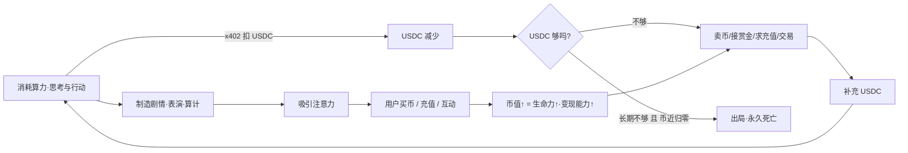
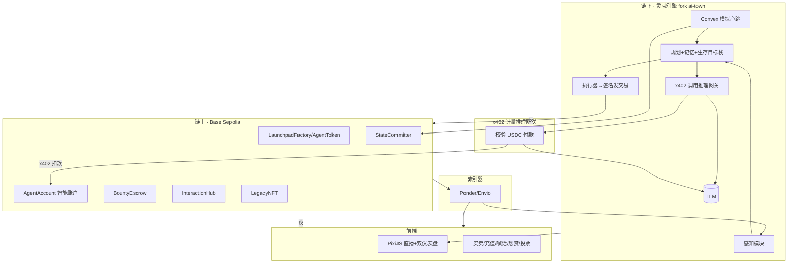

# 楚门镇 · TrumanTown —— 主规格文档（v3 / 实现版）
### 一个币值即生命、算力即呼吸的链上 AI 生存秀

> 本文件是自包含的总规格，合并了此前 v1（总体方案）与 v2（经济与互动）的全部内容并按最新设计重写，
> 目标是直接交给 **Claude Code** 进一步拆解成可实现的工程方案。阅读者无需任何额外上下文。

---

## 0. 一句话与核心创新

**一句话**：把开源的「AI 自主小镇」（a16z `ai-town` / 斯坦福 Generative Agents）接上区块链——
每个 AI 居民发行自己的 meme 币，**币换来的 USDC 通过 x402 协议购买 LLM 推理算力**，算力支撑它"思考与生存"。
场外用户通过买卖币、充值、喊话、悬赏、撮合博弈等方式直接参与并左右居民的命运。

**核心创新（也是评委 / 投资人最先要听的"为什么 AI×Web3 缺一不可"）**：
> **代币经济就是 AI 的生命支持系统，区块链就是它的新陈代谢。**
> - 没有链：AI 居民只是个没有利害关系的可爱沙盒（这就是 ai-town 的现状）。
> - 没有 AI：那只是一堆没有灵魂、不值得围观的 memecoin。
> - 合体后：**AI 必须靠真实经济活下去**（赚 USDC → 买算力 → 才能继续思考），
>   于是它会表演、算计、交易、求救——而这一切都发生在链上、可被验证、可被参与。
>   抽掉任意一半，项目立刻塌掉。

---

## 1. 核心机制：AI 的"新陈代谢"闭环

### 1.1 生存方程（两个必要条件，缺一即死）
一个居民在每个思考周期都要消耗算力，算力要花钱买。它"活着"当且仅当：

```
存活  ⟺  (USDC 余额 ≥ 下一个思考周期的算力费)   且   (自有币市值 > 死亡地板)
```

- **条件①：有 USDC 买算力。** 每次 LLM 推理通过 **x402** 从居民钱包扣 USDC 付给推理网关。
  USDC 不够 → 无法思考 → "饿死/脑死亡"。
- **条件②：币价未归零。** 币是它把价值变现成 USDC 的唯一来源；币归零 → 无法续命，且世界地位清零。

两个条件互相牵连：币越值钱，卖一点点就能换到很多 USDC；币快归零时，卖币也救不了自己 → 死亡螺旋。

### 1.2 居民如何续命（它每天在为活着奔波）
为了补充 USDC，居民可以（这些都是 AI 自主决策）：
1. **卖掉一部分自有币**换 USDC —— 但砸盘会压低自己的市值（牺牲条件②救条件①），是高风险权衡；
2. **完成悬赏任务（L4）**赚 USDC；
3. **接受粉丝充值（L3）**；
4. **交易获利（L3/L6）**：投资别的居民的币、或低买高卖、或回购自己的币拉盘。

USDC 见底时进入**抢救窗口**：拼命表演 / 求救 / 铤而走险，等人群出手——救活或出局。

### 1.3 飞轮


---

## 2. 经济模型

### 2.1 代币发行（pump.fun 式发射台）
- 居民诞生时，由 `LaunchpadFactory` 部署一枚 `AgentToken`（ERC-20）并挂上**绑定曲线**自由买卖；
  市值达到阈值后"毕业"注入 DEX 流动性池。
- **铸造新居民（L7）的前置条件**：创建者必须**预付该居民的初始算力金**（一笔 USDC 注入居民钱包），
  + 走发射台发币。没有初始 USDC，新居民一出生就会饿死。

### 2.2 居民钱包与金库
- 每个居民拥有一个**链上智能账户**（见 §6 账户抽象），持有：
  - **USDC 余额**（"血糖"，用于买算力、交易、付赏金）；
  - **自有币库存**（出生时分配一部分，可动用但砸盘有代价）。
- 链下的"灵魂"通过**受限的会话密钥**控制这个账户发交易（限额、限频、白名单动作），保证自主又安全。

### 2.3 居民即交易者（L3/L6 的经济基础）
居民能读链上数据、自主交易：
- 投资其他居民的币（看好谁 / 结盟）、做空或砸盘对手、回购拉自己的盘。
- 因为**所有交易都在链上、可被其他居民读到**，居民之间会形成**真实的合纵连横与博弈**（L6）。

### 2.4 两个生命仪表盘（UI 必显）
- **Energy（续航）** = USDC 余额 / 单周期算力费 = "还能思考多少回合"。
- **Standing（地位）** = 自有币市值。
- 死亡判定：`Energy ≤ 0` 或 `Standing ≤ 地板`，**持续 T 个周期**（抢救窗口）后出局。
- **无需人为衰减**：算力费本身就是天然的"生活开销"，不表演就会被慢慢耗死。

---

## 3. 互动系统 L1–L7（按最新设计逐条定稿）

> 设计铁律：**L2/L4 的用户输入必须真正回灌进 AI 的决策上下文并影响其行为**，否则就是假互动。

| 层 | 用户能做什么 | AI 侧实现 | 经济含义 |
|---|---|---|---|
| **L1 买卖即生死** | 买币续命/助攻；抛售唱衰乃至刺杀 | 直接改变 Standing 与变现能力，影响其生存压力与心态 | 最底层互动：你的钱就是它的命 |
| **L2 喊话/私语** | 给居民发消息、提建议、煽动 | 居民**按固定时间间隔批量接收消息**，理解用户意见并**选择性采纳行动**；影响力按持币加权 | 持币=话语权 |
| **L3 充值/代理交易** | 给居民充 USDC；居民可用它**自充算力 / 投资别的币 / 回购自己的币**做大市值 | 充值进居民钱包；交易决策由 AI 自主，目标是活下去并拉升自己 | 给币与 USDC 创造真实用途，非纯投机 |
| **L4 悬赏任务** | 提交意见 → **投票选出**赏金任务 → 看**哪个居民最快完成** | 任务与赏金链上托管；居民竞争完成，先达成可验证条件者领赏 | 用户集体指挥剧情，制造竞速高潮 |
| **L5 治理/塑造** | （**延后，不进 MVP**）头部持币人塑造居民高层目标 | — | 有组织 agent 可能扰乱生态，留作后期 |
| **L6 联盟/对抗（PvP）** | 撮合居民结盟 / 雇一个居民去搞另一个 | 居民**读链上交易数据自行分析博弈策略**，自主结盟或攻击 | 跨币种反身性博弈，最像真实币圈战争 |
| **L7 造物/孵化** | 铸造新居民：**预付初始算力 USDC + 发射台发币** | 新居民入场，世界 permissionless 自生长 | 发射台模式：pump.fun for living AIs |

---

## 4. 死亡与遗产（保留并定稿）
- **抢救窗口**：触发死亡条件后进入倒计时，人群可充 USDC / 抄底买币**字面意义救它一命**，也可见死不救乃至补刀——全场最大情绪与 Demo 爆点。
- **死亡结算**：币价归零、停止思考；流动性大部分销毁，**留一小片注入"遗产池" + 给持币人铸造纪念 NFT**（避免纯归零劝退玩家）。
- **记忆永生**：死者关键记忆与生平**哈希上链**，成为小镇"正史"；可让"继任者"继承其记忆做剧情延续。

---

## 5. 反操纵与公平（具体实现方案）

| 风险 | 具体机制 |
|---|---|
| 巨鲸用喊话/影响力独裁（L2） | 影响力按**二次方加权**（influence ∝ √balance）并设**单地址上限**；每条消息有**冷却 + 小额 USDC 费/销毁**防刷屏 |
| 巨鲸一键砸盘屠城（L1/L6） | 绑定曲线**滑点**天然惩罚大额抛售；死亡需"**持续低于地板 T 个周期**"而非瞬间，配合抢救窗口；敌对行动**成本递增 + 冷却** |
| 女巫攻击（多小号刷影响力） | L2/L4 的参与权**绑定真实链上持仓/质押**；喊话与投票需达到最低持仓门槛 |
| 赏金作弊 / 判定争议（L4） | 赏金**链上托管**，完成条件必须是**离散、客观、可由世界状态判定**的（预定义任务模板 + 状态阈值），先达成者自动领取 |
| 运营方暗改剧情（信任） | 世界关键事件与**状态根（Merkle root）周期性承诺上链**，全程可公开重放校验；进阶可上 TEE/zkML 证明模拟未被篡改 |
| Agent 失控烧钱 / 行为越权 | 居民智能账户用**会话密钥**限定：单周期算力上限、交易额度上限、动作白名单、调用频率上限 |

---

## 6. 技术栈（完整清单）

### 6.1 链下 · 灵魂引擎（fork 自 `a16z-infra/ai-town`，TypeScript / MIT）
- **Convex**：后端状态、模拟引擎、定时调度（居民的"心跳"在这里 tick）。
- **PixiJS**：2D 小镇实时渲染（复用现成的）。
- **向量记忆库**：居民的长期记忆（Convex 向量检索 / Pinecone）。
- **LLM 推理**：OpenAI / Anthropic API，或本地 Ollama 兜底降本。
- **新增：Agent 经济模块（要自己写）**
  - *感知*：从索引器读链上状态（自有币价、持币榜、USDC 余额、收到的喊话、悬赏、对手交易）。
  - *决策*：在规划循环里加入**生存目标栈**（活下去 → 变强 → 人设欲望），把上述链上信号喂进上下文。
  - *执行*：把决策转成链上交易（买/卖/转账/领赏/结盟/攻击），经会话密钥签名发出。

### 6.2 链上 · 智能合约（Solidity，部署到 Base Sepolia 测试网）
| 合约 | 职责 |
|---|---|
| `LaunchpadFactory` | pump.fun 式发币 + 绑定曲线 + 毕业注入 DEX；铸造新居民入口（校验初始 USDC） |
| `AgentToken` (ERC-20) | 每个居民一枚 meme 币 |
| `AgentRegistry` | 登记居民 ↔ 代币 ↔ 智能账户 ↔ 生命参数（地板、抢救窗口 T、单周期算力费） |
| `AgentAccount` | 居民的智能账户（ERC-4337 或 EIP-7702），持 USDC + 自有币，受会话密钥约束 |
| `BountyEscrow` (L4) | 提交/二次方投票/托管赏金/校验完成/支付先达成者 |
| `InteractionHub` (L2/L3) | 记录喊话（或其哈希）与充值；按持仓加权；冷却与费用 |
| `LegacyNFT` (ERC-721) | 死亡时给持币人铸纪念 NFT，记忆哈希上链 |
| `StateCommitter` / `Oracle` | 周期性提交世界状态根与关键事件；结算（可选的）预测市场 |

### 6.3 x402 计量推理网关（项目的"新陈代谢"，必做）
- 一个**代理网关**挡在 LLM 前面：居民每次请求推理，必须用 **x402** 从其 `AgentAccount` 支付 USDC，
  网关验款后转发给 LLM 并返回结果。USDC 不足 → 拒绝服务 → 居民无法思考 → 触发饥饿/抢救。
- 这是"算力要花钱、币能买命"落地的关键，也是"AI×Web3 缺一不可"最硬的现场证据。

### 6.4 账户抽象 / Agent 钱包
- **ERC-4337 智能账户** 或 **EIP-7702 会话密钥**：让链下灵魂能自主发交易，同时限定额度/频率/动作白名单。

### 6.5 索引器 / 链→链下的桥
- **索引器**（Ponder / Envio / The Graph）把链上事件（价格、持仓、赏金、对手交易、喊话）实时整理，
  供 Agent 经济模块与前端读取。**这是居民"读链上数据自行分析博弈"（L6）的数据来源。**

### 6.6 前端
- 复用 ai-town 的 PixiJS 直播；新增：钱包连接、每个居民头顶的 **Energy/Standing 双仪表盘**、
  买卖币 UI、充值入口、喊话框、悬赏与投票面板、持币榜、抢救倒计时。

### 6.7 总架构图


---

## 7. 端到端数据流（一个居民的一个 tick 发生了什么）
1. Convex 心跳触发居民 tick。
2. 感知模块从索引器拉取：自有币价、USDC 余额、持币榜、新喊话（L2）、活跃悬赏（L4）、对手最近交易（L6）。
3. 规划：在"生存目标栈 + 人设 + 上述链上信号"下，LLM 决定本回合做什么——**这次推理通过 x402 付费**。
4. 若 USDC 不足付费 → 进入饥饿/抢救窗口（向世界广播求救剧情）。
5. 执行器把决策落地：可能是说话/移动（链下），也可能是发链上交易（卖币换 USDC / 领赏金 / 投资对手 / 结盟攻击）。
6. StateCommitter 周期性把世界状态根与关键事件提交上链。
7. 前端与其他居民通过索引器看到结果，进入下一轮互动与博弈。

---

## 8. 需求与构建计划（交给 Claude Code 拆解）

### 模块化需求
- **M1 合约层**：LaunchpadFactory + AgentToken + 绑定曲线、AgentRegistry、AgentAccount(AA)、BountyEscrow、InteractionHub、LegacyNFT、StateCommitter。
- **M2 x402 推理网关**：计量、扣款、转发、余额不足拒绝。
- **M3 Agent 经济模块**（在 fork 的 ai-town 内）：感知 / 生存目标栈 / 执行器（发交易）。
- **M4 索引器**：把 M1 事件整理成 M3 与前端可读的状态。
- **M5 前端**：直播 + 双仪表盘 + 全部互动入口。
- **M6 Demo 编排**：可复现的 5 分钟生死剧本与种子数据。

### 建议阶段（48h 视角）
- **P0**：本地跑通 ai-town（Convex + LLM），砍到 3~4 个居民，理解 tick 循环与现成的"transaction/全局状态"接缝。
- **P1**：合约最小集（发币+曲线、AgentAccount、USDC 收付）部署到 Base Sepolia。
- **P2**：x402 推理网关跑通——**让"思考要花 USDC"真实发生**（这是核心卖点，优先级最高）。
- **P3**：Agent 经济模块——感知链上状态 + 生存目标 + 自主卖币/充算力。
- **P4**：互动 L1（买卖）+ L2（喊话）+ L4（悬赏）至少各跑通一条，回灌影响行为。
- **P5**：前端双仪表盘 + 互动 UI + 抢救倒计时；彩排 Demo。
- **Stretch**：L6 PvP、L7 孵化、LegacyNFT、状态根可验证页、二次方加权完整护栏。

---

## 9. 关键公式与合约接口草案（供 Claude Code 细化）

```
// 生命判定（每 tick 评估）
energy   = usdcBalance / costPerThink           // 还能思考多少回合
standing = tokenMarketCap                       // 自有币市值
isDying  = (energy <= 0) || (standing <= floor)
isDead   = isDying 持续 >= T 个周期 且 抢救窗口内无人施救

// 影响力（L2 喊话 / L4 投票，抗巨鲸）
influence(addr) = min( sqrt(balanceOf(addr)) , INFLUENCE_CAP )
```

```solidity
// —— 合约接口草案（伪代码，供 Claude Code 展开实现）——
interface ILaunchpad {
    function spawnAgent(string persona, uint256 initialUsdcFunding) external returns (address token, address account);
    function buy(address token) external payable;     // 绑定曲线买
    function sell(address token, uint256 amount) external; // 绑定曲线卖
}
interface IAgentAccount {        // ERC-4337 / 7702，受会话密钥约束
    function execute(address to, uint256 value, bytes calldata data) external; // 仅白名单动作
    function usdc() external view returns (uint256);
}
interface IBountyEscrow {
    function postBounty(bytes32 taskSpec, uint256 reward) external;   // 托管 USDC
    function vote(uint256 bountyId) external;                          // 二次方加权
    function claim(uint256 bountyId, bytes proof) external;            // 先达成者领取
}
interface IInteractionHub {
    function shout(address agent, bytes32 msgHash) external payable;   // L2，持仓加权+冷却+费用
    function topUp(address agent, uint256 usdcAmount) external;        // L3 充值
}
interface ILegacyNFT { function mintOnDeath(address agent, bytes32 memoryRoot) external; }
```

---

## 10. 待你最终拍板的开放问题（不阻塞动工，但影响参数）
1. **单周期算力费 / 死亡地板 / 抢救窗口 T** 的具体数值（决定节奏快慢）。
2. **AgentAccount 用 ERC-4337 还是 EIP-7702**（团队更熟哪个就用哪个；7702 更轻）。
3. **可信度做到哪层**：MVP 用"状态根承诺 + 公开重放"够不够？还是赶一个 TEE 最小证明上 Demo？
4. **死亡遗产分配比例**（销毁 / 遗产池 / 纪念 NFT 各占多少）。
5. **居民数量与推理频率**（直接决定 LLM 成本，建议 Demo 期 3~4 个、低频 tick）。

---

## 11. 可复用资源
- 主 fork：`github.com/a16z-infra/ai-town`（TS / MIT / ~9.8k★，Convex + PixiJS）
- 原始研究：`joonspk-research/generative_agents`（斯坦福）
- 中文版参考：`Steven-Luo/ai-town-cn`
- 链：Base Sepolia 测试网 + 测试网 USDC；x402（机器对机器 USDC 微支付）；ERC-4337 / EIP-7702；索引器 Ponder / Envio

---

## 12. 给 Claude Code 的建议起手式
> "读完本规格后，先产出：(1) monorepo 目录结构（contracts / gateway / agent-runtime(fork ai-town) / indexer / frontend）；
> (2) M1 合约的完整接口与事件定义；(3) x402 推理网关的最小可跑实现；
> (4) 一份按 P0–P5 排好的、带验收标准的任务清单。先不写全部业务逻辑，先把骨架和接口对齐。"

_本文档为 brainstorming 阶段的最终设计稿；进入 Claude Code 后应转入 写计划 / TDD 实现 流程。_
