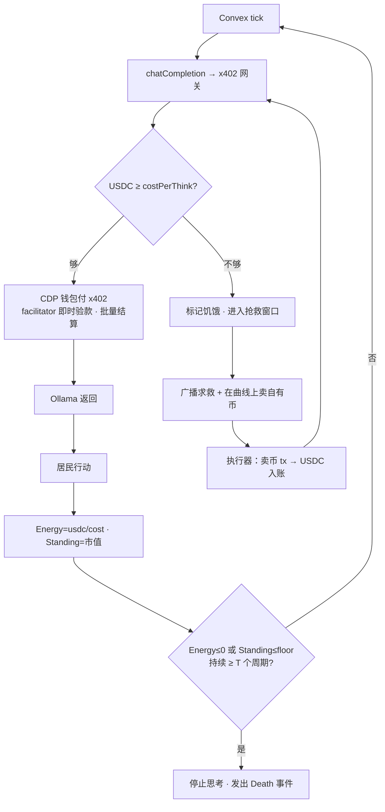

# 楚门镇 TrumanTown · 子项目 SP1 设计稿
## 代谢闭环 + 发币/Standing（首个垂直切片）

> 本文是 brainstorming 阶段的**最终设计稿**，对应主规格 [`docs/Web3_Agents.md`](../../Web3_Agents.md)。
> 它只覆盖**第一个子项目 SP1**，目标是直接转入「写计划（writing-plans）→ TDD 实现」流程。
> 范围、技术选型、环境拓扑均已与用户确认（见文末「已确认决策」）。

---

## 0. 背景与本切片要证明的论点

主规格的核心创新是：**代币经济就是 AI 的生命支持系统，区块链就是它的新陈代谢**。
整个方案是一个跨 5 个子项目的「程序」，不是单个可实现单元。SP1 是第一个**垂直切片**，
用最少的部件端到端跑通核心论点：

> **AI 居民必须支付真实 USDC 才能思考，而它自己的币是把价值变现成 USDC 的唯一生命线。**

SP1 完成后，后续子项目（L1 买卖+前端、L2/L4 互动、L3/L6 PvP、L7 孵化+遗产）在它之上逐层叠加。

---

## 1. 已确认决策（贯穿本切片）

| 维度 | 决策 | 含义 |
|---|---|---|
| 交付目标 | **可演进的 MVP** | 先做扎实骨架 + 接口对齐，真实跑通核心闭环；代码质量可持续迭代成产品，不赶 48h。 |
| 代谢真实度 | **真·每次推理付费（Base Sepolia）** | 每次推理都携带**真实、按次、签名的 USDC 授权**；结算可批量（见 §4）。 |
| 后端拓扑 | **切换到自托管 Convex（WSL 内全本地）** | Convex / Ollama / 网关 / 索引器 / 签名器全部跑在 WSL；**只有链本身是远程 Base Sepolia**。 |
| 合约栈 | Foundry / Solidity | 行业标准、本地 anvil 友好。 |
| Agent 钱包 | **Coinbase AgentKit + CDP 智能钱包** | Base Sepolia 原生、gasless、内置 faucet、**链上策略护栏**（限额/白名单）。密钥由 CDP 云端托管（唯一的云依赖，见 §3.3）。 |
| 发币/曲线 | **fork 开源 EVM pump.fun 曲线**（Ape City / Memex / Pump.sol 之一）改 USDC 储备 | productized 协议（Virtuals/Clanker/Zora）均主网或无曲线，不适配测试网。 |
| x402 计量 | **`x402-express` 中间件 + 自托管 facilitator**（OviatoHQ/second-state，指向 Base Sepolia） | 2026 年成熟标准（x402 Foundation：Coinbase/Cloudflare/Visa/Circle/AWS/Anthropic）。facilitator 跑在 WSL。 |
| 索引器 | Ponder（TypeScript） | 与现有 TS 栈一致、本地易跑。 |
| 链策略 | 本地 anvil 开发内环 → Base Sepolia 集成/Demo | 先快后真。 |
| 网关/执行器 | WSL 本地 Node 服务（执行器 = AgentKit 宿主） | 见 §3.2 / §3.3。 |

---

## 2. 整体架构（全部在 WSL，只有链是远程）

```
WSL（本地）                                                  远程
┌──────────────────────────────────────────────┐       ┌─────────────────┐
│ 自托管 Convex（docker） ← agent-runtime（fork） │       │ Base Sepolia     │
│   tick · 记忆 · 规划 · 经济模块                 │       │（+ 本地 anvil   │
│        │ chatCompletion()                       │       │   作开发内环）   │
│        ▼  （OLLAMA_HOST → 网关）                │       │                 │
│ ┌────────────────┐   ┌─────────────────────┐   │  RPC  │ Launchpad/Token │
│ │ x402 网关       │──▶│ Ollama（免费 llama3）│  │◀─────▶│ AgentAccount    │
│ │ 计量 + 扣款     │   └─────────────────────┘   │       │ Registry / USDC │
│ └──────┬─────────┘                              │       └────────┬────────┘
│        │ 验款 / 结算                             │                │ events
│ ┌──────▼─────────┐   ┌─────────────────────┐   │                ▼
│ │ 执行器(AgentKit)│──▶│ Ponder 索引器（db）  │◀─┼────────────────┘
│ │ CDP 智能钱包    │   └──────────┬──────────┘   │  CDP 钱包密钥
│ │ + 自托管        │              │ 感知          │  云端托管(唯一云依赖)
│ │   facilitator   │              │               │
│ └────────────────┘              │               │
│ 前端（Vite/PixiJS） ────────────┘               │
└──────────────────────────────────────────────┘
```

**唯一的外科手术接缝**：ai-town 的所有模型调用都已汇聚到
[`convex/util/llm.ts`](../../../convex/util/llm.ts) 的 `chatCompletion` / `fetchEmbedding`。
我们**只在这里**包一层 —— 引擎其余部分（tick、记忆、移动、对话）完全不动。

---

## 3. 组件设计

### 3.1 agent-runtime（fork 自 ai-town 的 Convex 后端）
- 复用现有 tick 循环、记忆、规划、对话（`convex/aiTown`、`convex/agent`、`convex/engine`）。
- **新增「经济模块」**（详见 §5）：感知 / 生存目标栈 / 执行器适配。
- `convex/util/llm.ts` 的请求出口由直连 Ollama 改为**指向 x402 网关**（仅改 `OLLAMA_HOST` 指向 + 处理 402）。

### 3.2 x402 网关（WSL 本地 Node 服务）
- 挡在 Ollama 前面，对外暴露 `/v1/chat/completions` 与 `/v1/embeddings`，用 **`x402-express` 中间件**做计量。
- 每个请求：
  1. 按 `costPerThink` 把这次推理**定价为 USDC**（免费的 Ollama 推理被「定价」成 USDC —— USDC/次 才是经济原语，与真实算力成本解耦）。
  2. 首次无支付凭证 → `x402-express` 返回 `402 Payment Required` + x402 付款要求（金额、收款地址=网关金库、资产=Base Sepolia USDC、nonce）。
  3. 带 `X-PAYMENT` 重试 → **自托管 facilitator** 验款（即时签名校验）→ 转发 Ollama → 返回补全。
  4. USDC 不足无法支付 → 持续返回 `402` → 居民进入饥饿/抢救。
- **自托管 facilitator**（fork `OviatoHQ/x402-facilitator-hono` 或 `second-state/x402-facilitator`），配 `RPC_URL_BASE_SEPOLIA`，提供 `/verify` 与 `/settle`，跑在 WSL。
- 我们自写的只有：**Ollama 反向代理 + 按 `costPerThink` 的定价胶水**。

### 3.3 执行器 = AgentKit 宿主（WSL 本地 Node 服务）
- 一个 Node 服务，内嵌 **Coinbase AgentKit**，为每个居民持有一个 **CDP 智能钱包**（即该居民的 `AgentAccount`）。Convex 经 HTTP 调用它来：
  - (a) 作为 **x402 付款方**：用居民的 CDP 钱包支付网关的 402 账单（AgentKit 集成 x402）；
  - (b) 提交链上交易：调用 `LaunchpadFactory` 的 buy/sell（绑定曲线）、transfer 等（AgentKit 的「任意合约调用」动作）。
- **护栏（链上）**：CDP 智能钱包的**策略/spend permission** 强制单周期/单笔限额、动作白名单；gasless（paymaster 代付）+ 内置 faucet 领测试网 USDC/ETH。
- **唯一的云依赖**：CDP 钱包密钥由 Coinbase 云端托管。其余（Convex、Ollama、网关、facilitator、索引器）全部 WSL 本地。这是用户在「最省事 + 链上护栏 + gasless」与「绝对全本地」之间的明确取舍。

**关于账户模型的演进说明：** 因此 SP1 **不自写 `AgentAccount` 合约** —— CDP 智能钱包即账户，护栏用其链上策略。
主规格里「会话密钥 / EIP-7702」的权限模型由 CDP 策略等价承载；若后续要去云依赖，可平滑替换为自托管的 ZeroDev/7702 智能账户（执行器接口不变）。

### 3.4 Ponder 索引器（WSL 本地）
- 索引链上事件（价格、持仓、USDC 余额、Death 等）→ 提供读 DB / API，供经济模块「感知」与前端读取。

### 3.5 合约（Foundry）—— 自写最小集
| 合约 | 职责（SP1 范围） | 来源 |
|---|---|---|
| `MockUSDC` | 仅用于本地 anvil；Base Sepolia 上**直接用 Circle 测试网 USDC**，不自部署。 | 自写（极薄） |
| `AgentToken`（ERC-20） + `LaunchpadFactory` | pump.fun 式发币 + **以 USDC 为储备资产的绑定曲线**（buy/sell；滑点天然惩罚砸盘，对应主规格 §5 反操纵）。Standing 由曲线推导市值。 | **fork 开源曲线**（Ape City/Memex/Pump.sol），储备从 ETH 改 USDC，Foundry 重写测试 |
| `AgentRegistry` | 登记 居民 ↔ 代币 ↔ **CDP 钱包地址** ↔ 生命参数（`costPerThink`、`floor`、`T`）。 | 自写（薄合约） |

> **不再自写 `AgentAccount` 合约**：CDP 智能钱包即账户，护栏走其链上策略（见 §3.3）。
> SP1 暂不做：`BountyEscrow`、`InteractionHub`、`LegacyNFT`、`StateCommitter`（属后续子项目）。

### 3.6 协议清单与各自职责（用现成的部分）
| 协议 / 库 | 在 SP1 里承担 | 不承担 / 边界 |
|---|---|---|
| **Coinbase AgentKit**（`@coinbase/agentkit`） | 给每个居民一个钱包；执行转账、绑定曲线 buy/sell（任意合约调用）；作 x402 付款方 | 不提供发币曲线本身（我们 fork）；不跑模拟（ai-town 跑） |
| **CDP 智能钱包**（AgentKit 钱包后端） | Base Sepolia 原生账户、gasless（paymaster）、faucet 领测试币、**链上 spend permission 护栏** | 密钥云端托管（唯一云依赖） |
| **x402**（`@coinbase/x402` + `x402-express`） | 网关侧 402 应答与 `X-PAYMENT` 解析；按次真实 USDC 付费 | 不含 LLM 代理（我们写）；结算交给 facilitator |
| **自托管 facilitator**（OviatoHQ / second-state） | `/verify` 即时验款、`/settle` 批量上链结算（指向 Base Sepolia） | 不定价（网关定价） |
| **开源 pump.fun EVM 曲线**（fork） | ERC-20 工厂 + 绑定曲线买卖 + 滑点惩罚 | 原版多为 ETH 储备 → 我们改 USDC 储备 |
| **Ponder** | 索引链上事件（价格/持仓/USDC/Death）→ 读 DB，供感知与前端 | 不发交易（执行器发） |
| **ai-town**（已有 fork） | tick / 记忆 / 规划 / 对话 | 不碰链（经济模块 + 执行器碰链） |
| **Foundry / anvil** | 合约开发、测试、本地链内环 | 集成/Demo 用 Base Sepolia |

---

## 4. 关键设计点：如何让「真·每次推理付费」与 Base Sepolia ~2s 出块共存

x402 协议把**验款（verify）**与**结算（settle）**分离：
- **验款**：即时的签名校验，无需上链。
- **结算**：真正把 USDC 转移上链。

因此 SP1 的做法是：**每次推理都携带一份真实、按次、签名的 USDC 授权**（所以付费是真实且按次的，
满足「缺一不可」的硬证据），但网关**每 N 次调用批量结算上链**。这样既保住核心论点，
又不让每个 tick 卡在出块上 —— 这对一个「可围观」的 Demo 是必要的。

---

## 5. 运行时经济模块（在 fork 内）

- **感知（Perception）**：从 Ponder 读取自有币价、USDC 余额、自有币库存等，整理成结构化上下文。
- **生存目标栈（Survival Goal Stack）**：注入规划 prompt，优先级：
  ① 活下去（保持 USDC > 算力费）→ ② 变强（拉升 Standing）→ ③ 人设欲望。
  饥饿时目标栈翻转，行为偏向**卖币换 USDC / 广播求救**。
- **执行器适配**：把 LLM 决策转成对执行器服务的 HTTP 调用（买/卖/转账）。

### 5.1 一个居民的端到端 tick 流程



---

## 6. 生命与死亡（SP1 范围）

```
energy   = usdcBalance / costPerThink       // 还能思考多少回合
standing = tokenMarketCap                   // 自有币市值（绑定曲线推导）
isDying  = (energy <= 0) || (standing <= floor)
isDead   = isDying 持续 >= T 个周期
```

- 触发死亡条件 → 进入抢救窗口倒计时（T 个周期）。
- 判死 → **停止 tick + 发出 `Death` 事件 + 币价归零**。
- **LegacyNFT / 记忆哈希上链 / 遗产池分配** 推迟到子项目 SP5，不在 SP1 范围。

---

## 7. 测试策略（TDD）

- **合约（Foundry）**：绑定曲线买卖与市值（Standing）数学；滑点惩罚；`AgentRegistry` 登记与生命参数读写。
- **CDP 护栏（配置 + 执行器）**：验证 spend permission 策略生效（超限单笔被拒）、动作白名单。
- **网关（单元）**：402 / 验款 / 结算路径（用本地 facilitator 或 mock）；余额不足拒绝服务。
- **集成（anvil 单居民）**：脚本化跑通两条剧本——
  ① 饥饿 → 卖币 → 复活；② 饥饿 → 无人施救 → 死亡。
- 先写测试、后写实现；先对齐骨架与接口，再填业务逻辑。

---

## 8. 默认参数（主规格 §10 开放问题的 SP1 取值）

| 参数 | 默认值 | 理由 |
|---|---|---|
| `costPerThink` | 0.01 USDC | 肉眼可见的消耗；约 100 次思考 / 1 USDC。 |
| tick 频率 | 1 次思考 / 30–60 秒 | 可围观且省钱（本地推理慢，低频更稳）。 |
| `floor`（死亡地板） | 发射市值的 5% | 给死亡螺旋留缓冲。 |
| `T`（抢救窗口） | 10 个周期（约 5–10 分钟） | 足够人群反应。 |
| SP1 居民数 | **1**（跑通后 3–4） | 先证明闭环再扩规模。 |
| 开发链 | anvil 内环 → Base Sepolia 集成 | 先快后真。 |

> 上述为可调默认值，进入实现后可在 `convex/constants.ts` / `AgentRegistry` 调参，不阻塞动工。

---

## 9. 后续子项目路线（SP1 之后，各自再走 brainstorm→spec→plan）

| 子项目 | 证明什么 | 关键部件 |
|---|---|---|
| **SP2** | 「你的钱就是它的命」 | L1 买卖 UI、钱包连接、PixiJS Energy/Standing 双仪表盘、抢救倒计时 |
| **SP3** | 用户输入真正回灌 AI 上下文 | `InteractionHub`、`BountyEscrow`、二次方加权、上下文注入 |
| **SP4** | 居民读链上数据互相博弈 | 索引器驱动策略、跨币种交易、结盟/攻击（L3/L6） |
| **SP5** | permissionless 自生长 + 可验证死亡 | L7 孵化、记忆哈希 `LegacyNFT`、`StateCommitter` 状态根 |

（L5 治理/塑造按主规格延后，不进 MVP。）

---

## 10. 不在 SP1 范围（明确的 Non-Goals）

- 任何前端互动 UI（买卖/喊话/悬赏/投票）——SP2 起。
- `BountyEscrow` / `InteractionHub` / `LegacyNFT` / `StateCommitter` 合约。
- L2/L3/L4/L6/L7 的全部逻辑。
- 多居民规模化、二次方加权护栏的完整实现。
- TEE/zkML 可信证明。

---

_本设计稿为 SP1 的最终拍板版；下一步进入 writing-plans，产出带验收标准的实现计划。_
